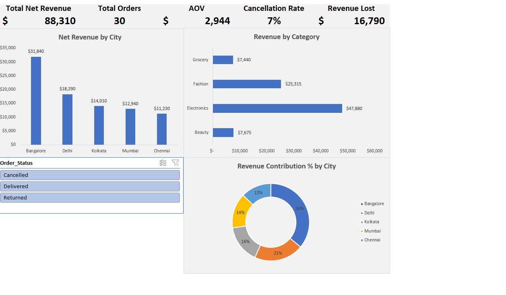

# excel-quickmart-mini-dashboard
Mini Excel practice: Power Query + pivots + dashboard

This is a small Excel practice project I made to revise Excel analytics + dashboarding on a retail-style dataset.

### Tools / Features Used
- Power Query (split columns, headers, data types, date parsing)
- Excel Tables (structured references)
- PivotTables + PivotCharts
- Slicer (Order Status) for quick filtering
- KPI cards + simple dashboard layout

### Functions & Formulas Used (from the workbook)
- IF / IFS / AND (flags + buckets like discount level, age group, payment category)
- UNIQUE (dynamic lists for city/category)
- SUMIFS (multi-condition revenue calculations)
- COUNTIFS (cancelled %, delivered/returned counts)
- AVERAGE + % calculations (AOV, revenue lost %, contribution %)
- INDEX + MATCH (lookup AOV / top city values)
- LARGE / MIN + RANK (top/bottom city + ranking)

### What’s inside
- **Dashboard**: KPIs + charts (Order Status slicer)
- **Insights**: short summary (Jan 2024)
- **Analysis**: supporting calculations/tables
- **Data**: source table

### Notes
Dataset is small (30 rows) and manually created for practice.  
Goal was to build something clean + interactive and practice formulas (not just pivots).

**Preview:**  

